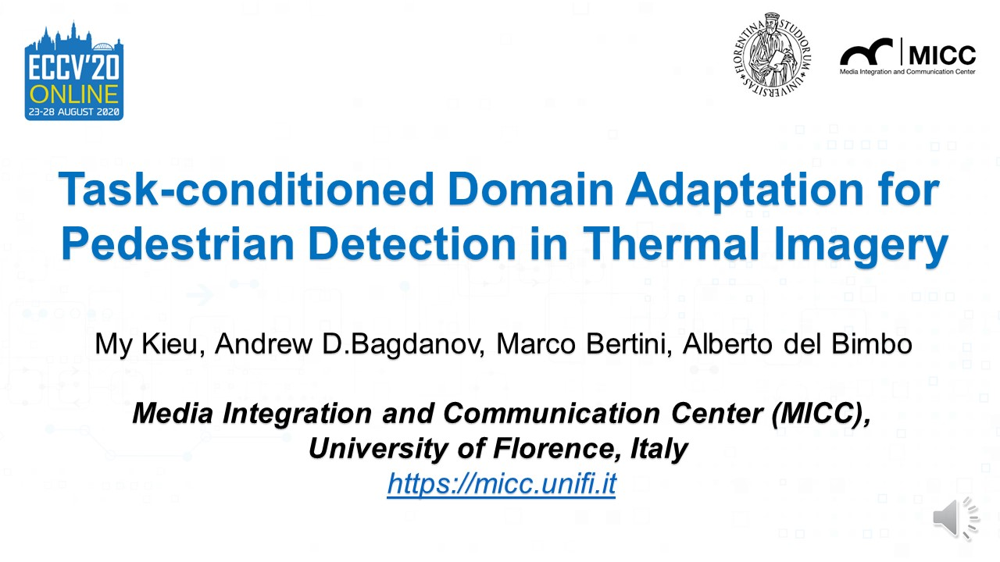
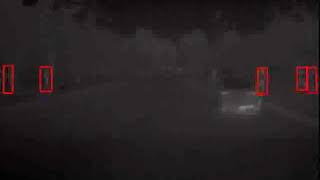
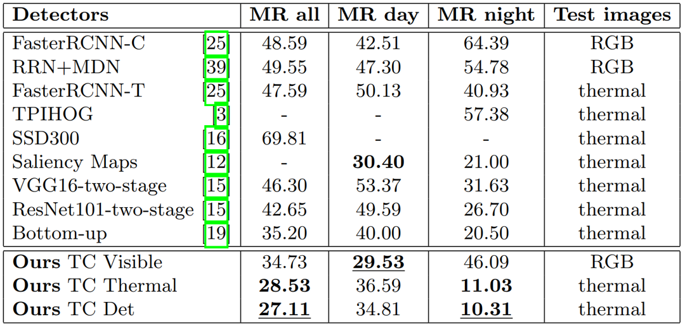

# <a href="https://www.researchgate.net/publication/343167450_Task-conditioned_Domain_Adaptation_for_Pedestrian_Detection_in_Thermal_Imagery"> Task-conditioned Domain Adaptation for Pedestrian Detection in Thermal Imagery </a>
## This implementation for our ECCV 2020 paper, training YOLOv3 on KAIST dataset with Task-conditioned network for Pedestrian Detection task in Thermal Domain.

### This implementation was expanded from our previous work which was the Best Student Paper Honorable Mention Award <a href="https://github.com/mrkieumy/YOLOv3_PyTorch"> "Domain Adaptation for Privacy-Preserving Pedestrian Detection in Thermal Imagery" </a> . 
### We added and changed many files and functions for our task-conditioned network.


### The short introduction of paper 
[](https://youtu.be/n_jD-FpDsaI "Click to play on Youtube.com")


### Improvement of this repository
* Developed the best single-modality state-of-the-art result for Pedestrian detection task on KAIST dataset.
* Invention Task-conditioned network architecture which simutaniously solves two related tasks (classification task and detection task).
* Improved training procedures such as learning rate strategy, calculation mean Average Precision (mAP).
* Added training procedure to decay learning rate by training loss and validation recall.
* Added Comparison of Log Average Miss Rate (Miss rate) with state-of-the-art of KAIST dataset. 
* Added monitor the training loss and validation performance for conditioning network during training. 
* Added many functions related to Task-conditioned network such as load and save weight, model, dataloader,evaluation, detection.
### How to run this repository
1. Download or clone this repository to your computer.
2. Install some basic requirements if needed such as (OpenCV, CUDA, CUDNN, Python,...)
3. Download <a href="https://drive.google.com/file/d/1okMBWb6NXVvY-fAtbLNK2ZnStu5x8oEU/view?usp=sharing">TC_Det_Model.model</a> or <a href="https://drive.google.com/file/d/1tEVCcBZKN9eubZrPZWEMb6LWfPB2WeYx/view?usp=sharing">TC_Det_Detector.weights </a> files and put in the directory 'weights' (create a new folder name 'weights" inside this repository).
4. Open a terminal and run following commands according to functions:

Noted that all of these instructions for Linux environment.

### Some default parameters:
* weightfile = weights/yolov3_kaist_tc_det_thermal.weights 
* configurationfile = cfg/yolov3_kaist_tc_det.cfg 
* datafile = data/kaist.data
* listname = data/kaist_person.names

For all of following commands, if command with [...] will be an option,
you can use your parameter or leave there to use default paramaters above.


### Detection (detect bounding box):
Detect bounding box result on image(s) or video by parameter: 
image file or folder with all images or video file. 
The result will appear with the same name + 'predicted'
```
python detect.py image/video/folder
Example:
python detect.py thermal_kaist.png
```

### Evaluation Performance includes mAP and Miss Rate:
Evaluation mean Average Precision (mAP) as well as Log Average Miss Rate (LAMR) of the detector over the test set.
Noted that, Log Average Miss Rate and Precision on reasonable setting (daytime, nighttime, and day & night) is the standard evaluation of the state-of-the-art on KAIST dataset.
```
python evaluation.py [weightfile]
```

### Draw bounding box:
Given the folder of images with its annotation.
Drawing bounding box on every image with correct detection (blue boxes),
wrong detection (red boxes) and miss detection (green boxes)

```
python drawBBxs.py imagefolder
```
There is an folder 'kaist_examples' for you to draw bounding box. 
Noted that, if you want to detect, the folder must contain only images (not contain any annotation files).

### Train your own data or KAIST data as follows:
Before training on KAIST or your own dataset, you should prepare some steps as follow:
1. Dataset (download <a href="https://drive.google.com/file/d/14A3K2IPPPC8-BwPh-YjeHARaZqjnR655/view?usp=sharing">KAIST_dataset </a> and place on a directory any place (better at root or in this current repository))
2. Modify the link to dataset on data/train_thermal.txt and test_thermal.txt.
3. Check some parameters in configuration files: data/kaist.data, cfg/yolov3_kaist.cfg such as train on thermal or visible, learning rate, number classes, etc,.
4. Some most important files you should customize:
    * data configuration (data/kaist.data) direct your training and testing list, number classes.
    * list of object names (data/kaist_person.name) contains a list of object name for your detection task.
    * trainlist and testlist (data/train_thermal.txt and data/test_thermal.txt) includes direction to each images and annotation for training and testing.
    * network configuration (cfg/yolov3_kaist.cfg or cfg/yolov3_kaist_tc_det.cfg) is your network and hyperparameters such as learning rate, batchsize, imagesize, step.
    More important is the last 3 blocks after yolo block. If your task is only one object, just put everything default and put the name object in data/kaist_person.name. Otherwise, you must change this information.
    Please look at this site for <a href= "https://github.com/AlexeyAB/darknet">how to customize configuration file (*.cfg) </a>.
    * Training file (train.py), at the end of this file, includes all parameters for training such as pre-trained weights, continue_trained model, data configuration file, network configuration file, training strategy and everything.
    
Then you can run experiments.
```
python train.py [-x y]
```
With -x and y as follow:
* -e: epoch (y is the number of epoch), defaut 50 epochs.
* -w: weightfile (y is the path of your weight file for pre-train), default kaist_thermal_detector.weights
* -d: datafile (y is the path of your data file), default data/kaist.data train on thermal images.
* -c: cfgfile (y is the path of your cfg file), default cfg/yolov3_kaist.cfg with lr=0.001

For example, if you want to train from yolov3 weight for a maximum of 100 epoch, you have:
```
python train.py -w weights/yolov3.weights -e 100 
```

* Weight and model files are saved in a backup folder at each epoch, and log of training saved in backup/savelog.txt

* You __should__ notice that you can control everything in train.py

* You can download other weights file for pre-trained such as:
<a href="https://drive.google.com/file/d/1xiSKTNEB5ng0T5kgyjUKytlpn3q84uK6/view?usp=sharing">kaist_visible_detector.weights </a>
or <a href="https://drive.google.com/file/d/1Kyoyira0liRRr_FOY8DDSeATLQAwXtu-/view?usp=sharing">kaist_thermal_detector.weights </a>
or ours best weight kaist detector augmented with GANs model.
<a href="https://drive.google.com/file/d/1RDzTEuYNJ3p9snmyGWQ6Irj-Ja6HL-DX/view?usp=sharing">kaist_mixing80_20.weights </a>.
Remember to place on 'weights' directory.
### Monitor the training loss and validation performance during training:
See the loss curve during training, also precision, recall curve of validation set for every epoch.
Noted that, validation set is splitted automatically from the training set during training with 10%.

```
python seeloss.py
```
for task-conditioned network (TC_Det)
```
python seeloss_condition.py
```

### Plotting Results (Log Average Miss Rate curves):
Plotting the Log Average Miss Rate (LAMR) and Average Precision for both Ours ablation studies and state-of-the-art multispectral results.
You will see image files of plot on this repository.
```
python plot_LAMR.py
```
Noted that, before plotting results, check all result .JSON files in the results/ablation/*. 

If you want to plot the comparison with multispectral state-of-the-art results, 
(1) Download <a href="https://drive.google.com/file/d/1CYFYkfv7Y1_rBsGBtwXDdBj42RIAqTiJ/view?usp=sharing">Multispectral SOTA results </a> and extract to the directory results/SOTA.
(2) In file Plot_LAMR.py, comment Ablation studies part (lines 80 -> 84), 
and comment out SOTA part (lines 45 -> 55, and lines 90 -> 100). 

If you want to plot your result together. (1) Evaluation your detector file. (2)Then you will see detection_result.JSON file in results/ folder (you can rename it or not).
(3) In Plot_LAMR.py file, adding your detector at after the line 55, reference to your *.JSON file. (4) Add the short name (line 85) and then run this Plot_LAMR.py file. 

### Demo on webcam:
Please check it

```
python demo.py
```


### Example results:


Video of Results: 
[](https://youtu.be/gZP8Qp41bGo "Click to play on Youtube.com")

### Results on KAIST dataset:
#### Our reported result on ECCV 2020 paper:

 
 
 Other numbers:
 
* mean Average Precision (mAP): 61.49%

| Reasonable | Day & Night | Day | Night
| --- | --- | --- | --- |
| Precision | 82.87% | 77.16% | 93.82% |
| Miss Rate | 27.11% | 34.81% | 10.31% |

The paper is available here <a href="https://www.researchgate.net/publication/343167450_Task-conditioned_Domain_Adaptation_for_Pedestrian_Detection_in_Thermal_Imagery"> Task-conditioned Domain Adaptation for Pedestrian Detection in Thermal Imagery </a>

## Citation
We really hope this repository is useful for you. Please cite our paper as
```
@inproceedings{KieuECCV2020taskconditioned,
	Author = {Kieu, My and Bagdanov, Andrew D and Bertini, Marco and Del Bimbo, Alberto},
	Booktitle = {Proc. of European Conference on Computer Vision (ECCV)},
	Title = {Task-conditioned Domain Adaptation for Pedestrian Detection in Thermal Imagery},
	Year = {2020}
	}

```

If you have any comment or question about this repository, please leave it in Issues.

Other contribution, please contact me by email: my.kieu@unifi.it.

Thank you so much for your interest in our work.
